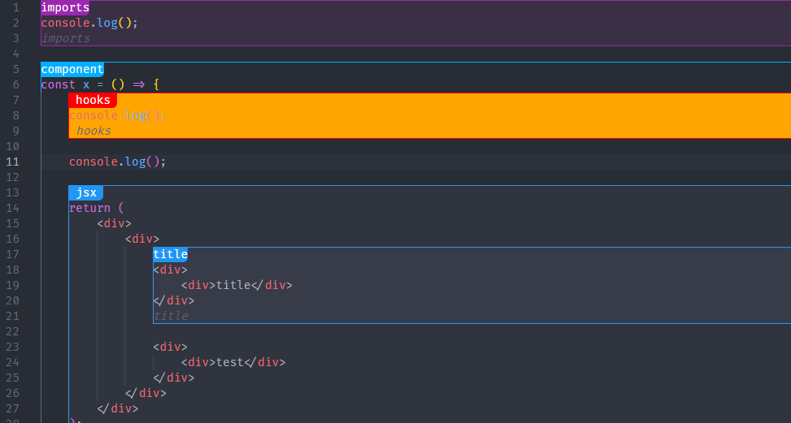

# semanticscopes

Use specialized comments to improve workflow by separating code to logical blocks

motivation:
have visual anchors for areas of code, to improve organization
and block based workflow, blocks can be folded, jumped to (NYI), or even switched around (NYI)

## Features

Highlighting regions of code based on comments



## Extension Settings

You can configure a preset of style overrides as well as the default theme in the following settings: (⚠ NYI)

```jsonc
{
	"semanticscopes.theme": {
		// default theme configuration
		"primary": "red", //used to color the outline and title background
		"text": "red", // the title text color
		"background": "red", // the background color of the codeblock

		"selected": {
			// these styles will override when a caret is present inside the codeblock
			"primary": "purple",
			"text": "purple",
			"background": "purple"
		}
	},

	"semanticscopes.overrides": {
		"imports": {
			// will override styles if the trimmed title is equal to the key
			"primary": "red",
			"text": "red",
			"background": "red",

			"selected": {
				"primary": "purple",
				"text": "purple",
				"background": "purple"
			}
		}
	}
}
```

## Known Issues

-   Some deeply nested blocks may render weird
-   Selections look weird when the region has background color
-   the left side of the border is sometimes hidden when inside scopes
